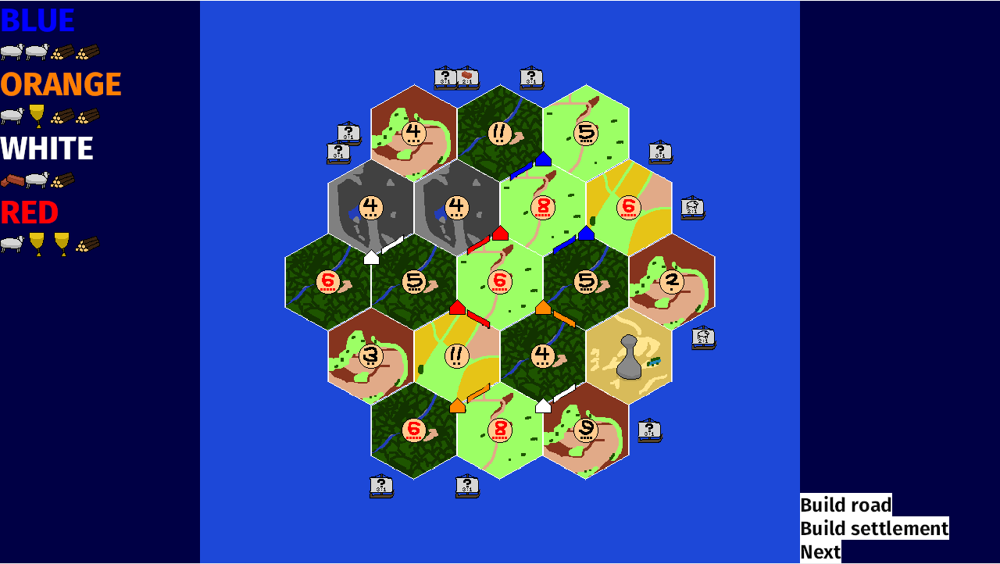

# Cotton

Cotton is an open source board game in the vain of Settlers of Catan, written in Bevy.
It's a side project and a bit of an experiment.
I'm avoiding using states and events, since I tend to use them a lot.
When this is done, I might fork it into a private repo and make a bit more of my own game.
Feel free to do the same!

## TODO

- [ ] Status bar
- [ ] Domestic trade
- [ ] Maritime trade
- [ ] Robber
- [ ] Build city
- [ ] Buy development card
- [ ] Play development card
- [ ] Victory point counter
- [ ] Longest road card
- [ ] Largest army card
- [ ] Victory
- [ ] AI opponents?
- [ ] Networked play?

## Contributing

If you're interested in helping with the above TODO items, or making general improvements, go ahead!
However, if you want to make other changes (overhauls, new features, etc.), I encourage you to make a fork.
If you need help/advice, feel free to ping me (@Seldom) on the Bevy Discord.

## License

The code and assets in this repository are dual-licensed under either:

- MIT License ([LICENSE-MIT](LICENSE-MIT) or [http://opensource.org/licenses/MIT](http://opensource.org/licenses/MIT))
- Apache License, Version 2.0 ([LICENSE-APACHE](LICENSE-APACHE) or [http://www.apache.org/licenses/LICENSE-2.0](http://www.apache.org/licenses/LICENSE-2.0))

at your option.

Unless you explicitly state otherwise, any contribution intentionally submitted
for inclusion in the work by you, as defined in the Apache-2.0 license,
shall be dual licensed as above, without any additional terms or conditions.
